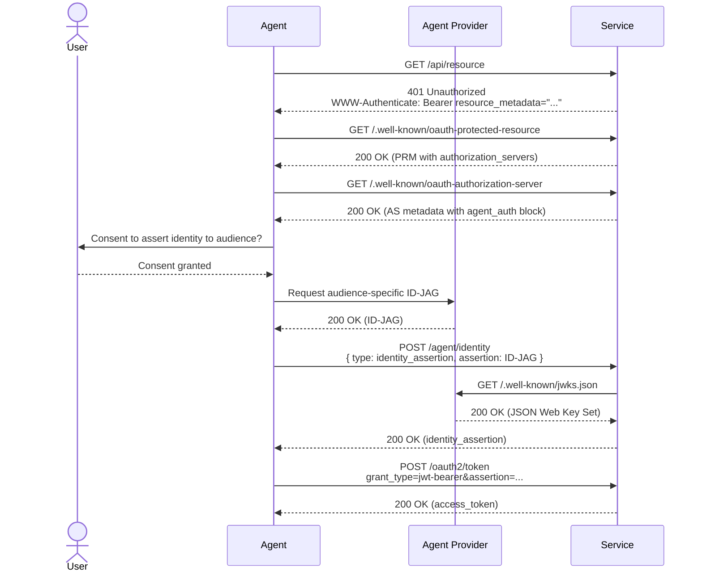
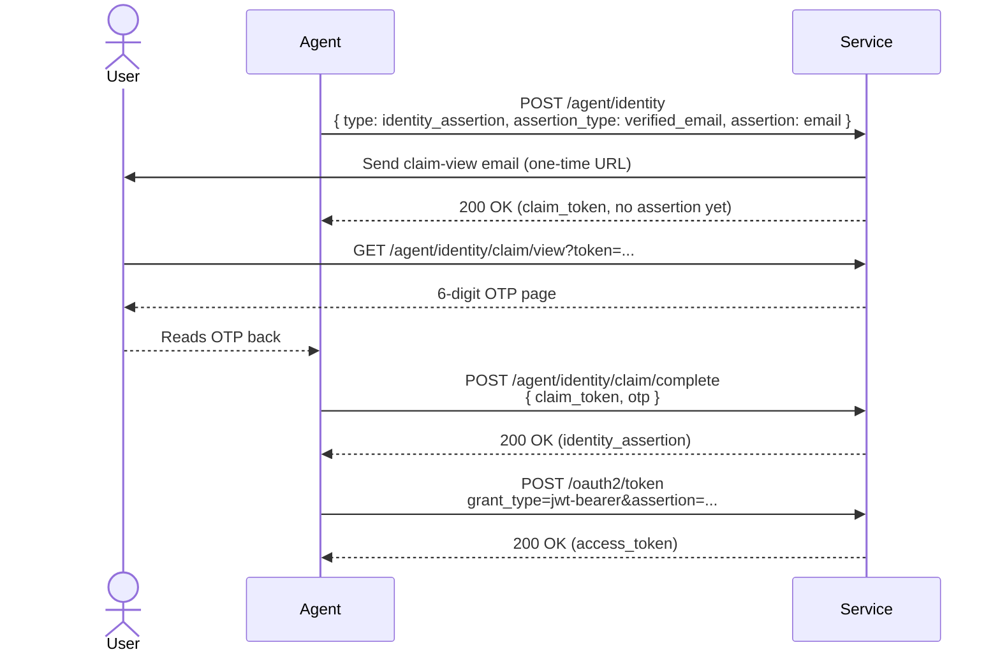
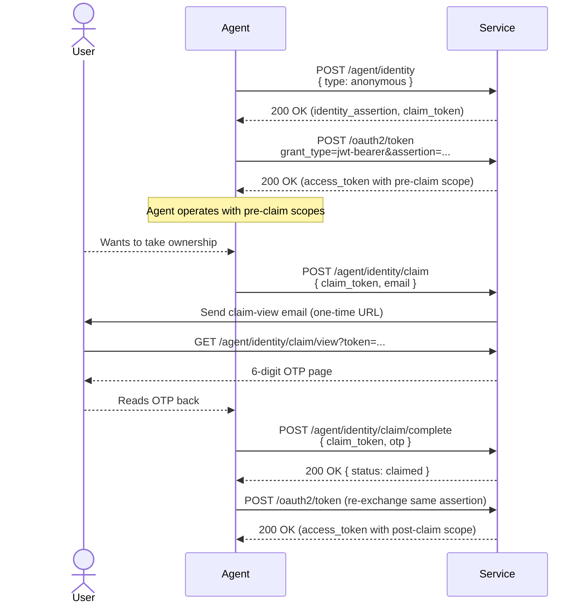

# auth.md

A reference implementation of **agentic registration** — a protocol for agents to authenticate to services on behalf of users. Three roles: an **agent** acting for a user, an **agent provider** that mints identity assertions ([ID-JAGs](https://datatracker.ietf.org/doc/draft-ietf-oauth-identity-assertion-authz-grant/)), and a **service** that accepts those assertions, when available, and issues credentials. If the agent is not associated with a user identity, or the agent provider does not support ID-JAGs, the service uses an OTP-based claim flow to authenticate the agent instead.

This repo includes sample implementations for both the agent provider and agent service side of agentic registration, and includes a sample [`AUTH.md`](AUTH.md) file, which the agent service would host, instructing agents how to authenticate with the service.

## Layout

```
.
├── AUTH.md            ← skill manifest agents read
├── agent-services/    ← sample resource server + authorization server
├── agent-providers/   ← sample agent IdP that mints ID-JAGs
└── shared/            ← shared workspace package (ports, types)
```

## Where to go next

- **You're an agent or want an auth.md template** → [AUTH.md](AUTH.md) — procedural recipe (discover → register → claim → exchange → use → handle revoke).
- **You're implementing a service** → [agent-services/README.md](agent-services/README.md) — full implementation guide, sequence diagrams, error tables.
- **You're implementing an IdP** → [agent-providers/README.md](agent-providers/README.md) — minting ID-JAGs, publishing JWKS, sending revocation events.

## Quickstart

```sh
pnpm install
pnpm dev
```

Service at <http://localhost:8000>, provider at <http://localhost:4000>. The service home page walks the three registration flows interactively. Use `pnpm dev:service` or `pnpm dev:provider` to run one side at a time.

## System Flows

Registration and credential issuance are split across two endpoints. `POST /agent/identity` accepts the agent's chosen identity proof (ID-JAG, verified email, or anonymous) and returns a service-signed `identity_assertion`. The agent then exchanges that assertion at `POST /oauth2/token` (RFC 7523 JWT-bearer grant) for an access_token.

### Discovery

Hosted at `/.well-known/oauth-authorization-server`:

```json
{
  "resource": "https://api.service.example.com/",
  "authorization_servers": ["https://auth.service.example.com/"],
  "scopes_supported": ["api.read", "api.write"],
  "bearer_methods_supported": ["header"],

  "issuer": "https://auth.service.example.com",
  "token_endpoint": "https://auth.service.example.com/oauth2/token",
  "revocation_endpoint": "https://auth.service.example.com/oauth2/revoke",
  "grant_types_supported": ["urn:ietf:params:oauth:grant-type:jwt-bearer"],

  "agent_auth": {
    "skill": "https://service.example.com/auth.md",
    "identity_endpoint": "https://auth.service.example.com/agent/identity",
    "claim_endpoint": "https://auth.service.example.com/agent/identity/claim",
    "revocation_uri": "https://auth.service.example.com/agent/auth/revoke",
    "identity_types_supported": ["anonymous", "identity_assertion"],
    "identity_assertion": {
      "assertion_types_supported": [
        "urn:ietf:params:oauth:token-type:id-jag",
        "verified_email"
      ]
    },
    "events_supported": [
      "https://schemas.workos.com/events/agent/auth/identity/assertion/revoked"
    ]
  }
}
```

The top-level `issuer` / `token_endpoint` / `revocation_endpoint` / `grant_types_supported` are standard [RFC 8414](https://datatracker.ietf.org/doc/html/rfc8414) / [RFC 7009](https://datatracker.ietf.org/doc/html/rfc7009) / [RFC 7523](https://datatracker.ietf.org/doc/html/rfc7523) fields. The `agent_auth` block is the profile extension carrying the registration and claim surface.

### Identity Assertion (ID-JAG)



### Verified-Email Identity Assertion



### Anonymous Registration with OTP Claim


