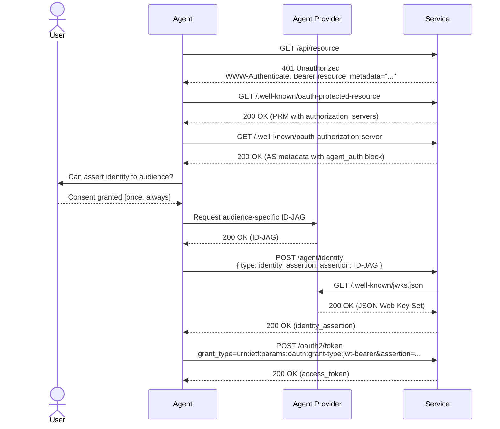

# Agent Auth Provider Guide

Agents are hitting walls trying to use APIs and SDKs that have been built to keep robots out for years. Requiring the end-user to sign up via the web, create an API key, and pass that to the agent is an unnecessary break in flow for everyone involved.

This protocol suggests an agent discovery layer on top of [Identity Assertion JWT Authorization Grants (ID-JAGs)](https://datatracker.ietf.org/doc/html/draft-ietf-oauth-identity-assertion-authz-grant) to enable trusted agent providers (you!) to authenticate with resource servers on behalf of users by asserting their identities.

Signing ID-JAGs makes your surface the identity broker for every service a user's agent touches — you keep the consent prompt, the revocation UX, and the delegation audit trail inside your product instead of leaking them to wherever the user would otherwise paste an API key.

## Identity Assertion Sequence



## Minimum Agent Provider Implementation

1. Enable agents to exchange their sessions for ID-JAG tokens upon user consent
2. Host discovery documents (JWKS, CIMD) that enable downstream services to validate and verify the ID-JAGs
3. Direct agents to introspect the `agent_auth` block of the consuming service's `.well-known/oauth-authorization-server`

### Discovering Agent Auth

Agents will discover the agent registration pathway through multiple channels, including service documentation, SDKs, and self-documenting APIs. The primary entry-point is an agent auth enrichment layer on the consuming service's OAuth Authorization Server metadata, surfaced via the [RFC 9728 (OAuth 2.0 Protected Resource Metadata)](https://datatracker.ietf.org/doc/html/rfc9728) handshake. Services can also publish an `auth.md` document that includes at least a breadcrumb to the protected resource document.

Discovery is two-hop:

1. **Protected Resource Metadata (PRM)** at `.well-known/oauth-protected-resource` (per RFC 9728) — the resource server advertises its authorization servers. On any 401, the resource server includes a `WWW-Authenticate: Bearer resource_metadata="..."` header pointing here:

   ```json
   {
     "resource": "https://api.service.example.com/",
     "resource_name": "Service",
     "resource_logo_uri": "https://service.example.com/logo.png",
     "authorization_servers": ["https://auth.service.example.com/"],
     "scopes_supported": ["api.read", "api.write"],
     "bearer_methods_supported": ["header"]
   }
   ```

2. **Authorization Server metadata** at `<authorization_servers[0]>/.well-known/oauth-authorization-server` — this is where the `agent_auth` block lives. The agent reads `authorization_servers[0]` from the PRM and fetches:

   ```json
   {
     "resource": "https://api.service.example.com/",
     "authorization_servers": ["https://auth.service.example.com/"],
     "scopes_supported": ["api.read", "api.write"],
     "bearer_methods_supported": ["header"],

     "issuer": "https://auth.service.example.com",
     "token_endpoint": "https://auth.service.example.com/oauth2/token",
     "revocation_endpoint": "https://auth.service.example.com/oauth2/revoke",
     "grant_types_supported": [
       "urn:ietf:params:oauth:grant-type:jwt-bearer",
       "urn:workos:agent-auth:grant-type:claim"
     ],

     "agent_auth": {
       "skill": "https://service.example.com/auth.md",
       "identity_endpoint": "https://auth.service.example.com/agent/identity",
       "claim_endpoint": "https://auth.service.example.com/agent/identity/claim",
       "events_endpoint": "https://auth.service.example.com/agent/event/notify",
       "identity_types_supported": ["anonymous", "identity_assertion", "service_auth"],
       "identity_assertion": {
         "assertion_types_supported": [
           "urn:ietf:params:oauth:token-type:id-jag"
         ]
       },
       "events_supported": [
         "https://schemas.workos.com/events/agent/auth/identity/assertion/revoked"
       ]
     }
   }
   ```

   The top-level `token_endpoint`, `revocation_endpoint`, and `grant_types_supported` are standard [RFC 8414](https://datatracker.ietf.org/doc/html/rfc8414) / [RFC 7009](https://datatracker.ietf.org/doc/html/rfc7009) / [RFC 7523](https://datatracker.ietf.org/doc/html/rfc7523) fields. The `agent_auth` block carries the profile-specific bootstrap, claim, and SET-receive endpoints.

### Minting the Identity Assertion

```json
{
  "typ": "oauth-id-jag+jwt",
  "alg": "ES256", // or RS256, etc.
  "kid": "<provider key id>"
}
.
{
  // required
  "iss": "https://api.agent-provider.example.com",
  "sub": "<opaque user identifier>",
  "aud": "https://auth.service.example.com",
  "client_id": "<iss or CIMD URL>",
  "jti": "<unique identifier for the token to prevent replay>",
  "iat": <issuance epoch seconds>,
  "exp": <iat + 5m>,
  "auth_time": <epoch seconds the user last authenticated at your provider>,
  "email": "user@example.com",
  "email_verified": true,

  // optional
  "amr": ["mfa"],
  "name": "Jane Smith",
	"phone_number": "+15553805188",
	"phone_number_verified": false,
	"resource": "https://api.service.example.com",

  // optional agent metadata
  "agent_platform": "<your-agent-surface>",
  "agent_context_id": "<chat-id>"
}
```

`auth_time` is required (not optional). Consuming services enforce a max age on it — typically one hour — and reject older ID-JAGs with `401 login_required`, expecting the agent to refresh the user's session at your provider (`prompt=login` or equivalent) before minting a new one. Freshen `auth_time` whenever the user re-authenticates; don't reuse a long-lived session timestamp.

### Hosted Discovery Documents

In order for consuming services to verify the ID-JAG tokens, agent providers must publish a document specifying their [JSON Web Key Sets (JWKS)](https://datatracker.ietf.org/doc/html/rfc7517), usually at `.well-known/jwks.json`.

**Optional: Client ID Metadata Document (CIMD).** Agent providers can also host an [OAuth Client ID Metadata Document](https://datatracker.ietf.org/doc/draft-ietf-oauth-client-id-metadata-document/) and use the URI as the `client_id` value in the ID-JAG. This decouples your provider identity from your signing keys — you can rotate JWKS without churning every consumer's trust list — and makes it convenient for trusted agent registries to list providers. Adopt this if you expect signing-key rotation or registry listing to matter; skip it for v0.1 and your `client_id` can be your issuer URL. The CIMD document might look something like:

```json
{
  "client_id": "https://api.agent-provider.example.com/agent-auth.json",
  "client_name": "Agent Provider",
  "logo_uri": "https://agent-provider.example.com/logo.png",
  "client_uri": "https://agent-provider.example.com",
  "tos_uri": "https://agent-provider.example.com/tos",
  "policy_uri": "https://agent-provider.example.com/privacy",
  "token_endpoint_auth_method": "private_key_jwt",
  "jwks_uri": "https://agent-provider.example.com/.well-known/jwks.json",
  "scope": "openid email profile"
}
```

### Acquiring an access token

Exchanging an ID-JAG for an access_token is a two-step dance: the consuming service first issues its own service-signed identity assertion bound to the registration, then the agent exchanges that assertion at the OAuth token endpoint.

**Step 1 — register the identity.** Submit the provider ID-JAG to the service's `identity_endpoint`:

```http
POST /agent/identity HTTP/1.1
Host: auth.service.example.com
Content-Type: application/json

{
  "type": "identity_assertion",
  "assertion_type": "urn:ietf:params:oauth:token-type:id-jag",
  "assertion": "eyJhbGc..."
}
```

200 response — the service verified the ID-JAG, found or JIT-provisioned the user, and minted a service-signed `identity_assertion`:

```json
{
  "registration_id": "reg_...",
  "registration_type": "identity_assertion",
  "identity_assertion": "<service-signed JWT>",
  "assertion_expires": "2026-05-04T13:00:00.000Z",
  "scopes": ["api.read", "api.write"]
}
```

**Step 2 — exchange the assertion at `/oauth2/token`.** Standard [RFC 7523](https://datatracker.ietf.org/doc/html/rfc7523) JWT-bearer grant:

```http
POST /oauth2/token HTTP/1.1
Host: auth.service.example.com
Content-Type: application/x-www-form-urlencoded

grant_type=urn:ietf:params:oauth:grant-type:jwt-bearer
&assertion=<service-signed identity_assertion>
&resource=https://api.service.example.com/
```

200 response is a standard OAuth token envelope:

```json
{
  "access_token": "<token>",
  "token_type": "Bearer",
  "expires_in": 3600,
  "scope": "api.read api.write"
}
```

If the access_token expires, the agent re-calls `/oauth2/token` with the same identity assertion. If the assertion itself is expired or revoked, `/oauth2/token` returns `invalid_grant` and the agent re-calls `/agent/identity` to mint a fresh one. The ID-JAG flow does not issue OAuth refresh_tokens — the two-step pattern replaces refresh.

#### Errors

Errors at `/agent/identity` describe profile-specific states; errors at `/oauth2/token` follow OAuth-standard vocabulary.

| Endpoint          | Error code                   | Meaning                                                                                                                                                                                                     |
| ----------------- | ---------------------------- | ----------------------------------------------------------------------------------------------------------------------------------------------------------------------------------------------------------- |
| `/agent/identity` | `invalid_issuer`             | Token `iss` isn't in the service's trusted providers list.                                                                                                                                                  |
| `/agent/identity` | `invalid_signature`          | JWKS lookup failed or the signature didn't verify against any known key.                                                                                                                                    |
| `/agent/identity` | `expired`                    | `exp` is in the past.                                                                                                                                                                                       |
| `/agent/identity` | `replay_detected`            | `jti` has already been seen within the replay window.                                                                                                                                                       |
| `/agent/identity` | `invalid_audience`           | `aud` doesn't match the service's auth server.                                                                                                                                                              |
| `/agent/identity` | `invalid_client_id`          | `client_id` doesn't resolve to a known provider identity.                                                                                                                                                   |
| `/agent/identity` | `missing_verified_email`     | Neither `email_verified` nor `phone_number_verified` is `true`.                                                                                                                                             |
| `/agent/identity` | `invalid_request`            | Body shape, missing claims, or unverified identity (neither `email_verified` nor `phone_number_verified` is `true`).                                                                                        |
| `/agent/identity` | `interaction_required` (401) | Step-up: service knows the user by email/phone but needs them to confirm linking your `(iss, sub)`. Response body carries a `claim` block — surface it to the user. Not your problem to fix; just hand off. |
| `/agent/identity` | `login_required` (401)       | `auth_time` missing or older than the service's `max_age` (in the response). Re-authenticate the user at your end and mint a fresh ID-JAG.                                                                  |
| `/oauth2/token`   | `invalid_grant`              | Assertion failed verification, expired, replayed, audience-mismatched, or has been revoked.                                                                                                                 |
| `/oauth2/token`   | `invalid_client`             | `client_id` doesn't resolve to a known provider identity.                                                                                                                                                   |
| `/oauth2/token`   | `unsupported_grant_type`     | `grant_type` is not `urn:ietf:params:oauth:grant-type:jwt-bearer`.                                                                                                                                          |

## Downstream Verification

Services maintain a list of trusted agent providers. On first contact with a `(iss, sub)` pair the service has three resolutions:

1. **Existing delegation** — `(iss, sub)` is already bound to a user. Clean match; return a service-signed identity_assertion immediately.
2. **JIT-provisioned** — no existing user matches the ID-JAG's verified email/phone. Service creates a new user and binds the delegation. Clean match.
3. **Step-up required** — `(iss, sub)` is new but the verified email/phone matches an _existing_ user. The service won't silently bind the delegation; it returns a 401 `interaction_required` with a claim ceremony so the user can confirm the link.

Services reject ID-JAGs with neither a verified email nor a verified phone number, and reject ID-JAGs whose `auth_time` is older than the service's `max_age` (typically 1 hour) with `401 login_required` — agents must refresh the user's authentication at the provider before retrying.

## Tracking and Revocation

In a robust implementation, agent providers will want to track the services to which identity assertions have been delegated so that the user can revoke the delegation if needed from a control plane. The discovery document's `agent_auth.events_endpoint` is where the provider transmits identity-event SETs to the service. Transmission is the canonical [RFC 8935](https://datatracker.ietf.org/doc/html/rfc8935) push-based delivery of a [Security Event Token (RFC 8417)](https://datatracker.ietf.org/doc/html/rfc8417):

```json
POST /agent/event/notify HTTP/1.1
Host: auth.service.example.com
Content-Type: application/secevent+jwt

// header
{
  "typ": "secevent+jwt",
  "alg": "ES256", // or RS256, etc.
  "kid": "<provider key id>"
}
.
// payload
{
  "iss": "https://api.agent-provider.example.com",
  "sub": "<opaque user identifier>",
  "aud": "https://auth.service.example.com",
  "jti": "<unique identifier to prevent replay>",
  "iat": <epoch seconds>,
  "events": {
    "https://schemas.workos.com/events/agent/auth/identity/assertion/revoked": {}
  }
}
```

The receiving service validates the SET against the provider's JWKS, dispatches on the `events` claim, and invalidates the identity assertion (and the credentials derived from it). Per RFC 8935 §2.4, a successful receive returns 202 Accepted; failures return 400 with `{ "err": "<code>", "description": "..." }`.

Note that this `events_endpoint` is distinct from the top-level `revocation_endpoint`. The `revocation_endpoint` ([RFC 7009](https://datatracker.ietf.org/doc/html/rfc7009)) is for the agent or admin to kill a single bearer credential by value. The `events_endpoint` is for the provider to notify the service of an upstream identity event — a broader signal that invalidates the registration itself.

In a future state, we expect richer [SET](https://datatracker.ietf.org/doc/html/rfc8417) / [CAEP](https://openid.net/specs/openid-caep-1_0-final.html) / RISC event communication between agent providers and consuming services, layered on this same push-based SET delivery channel.
