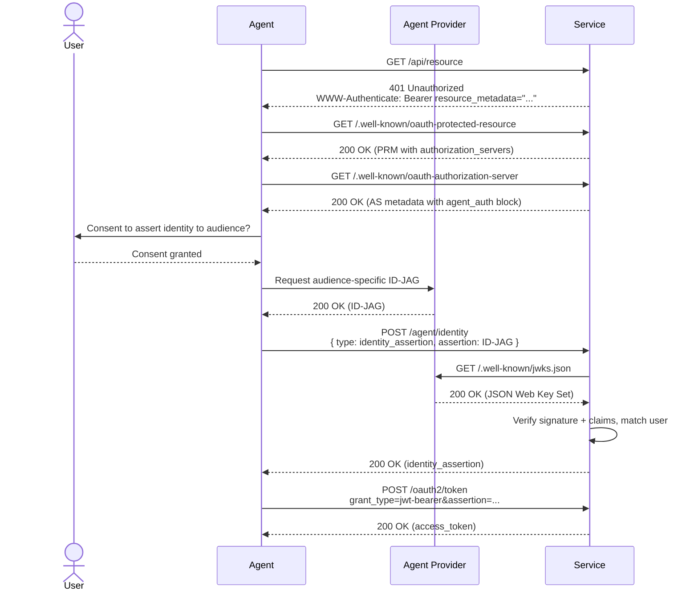
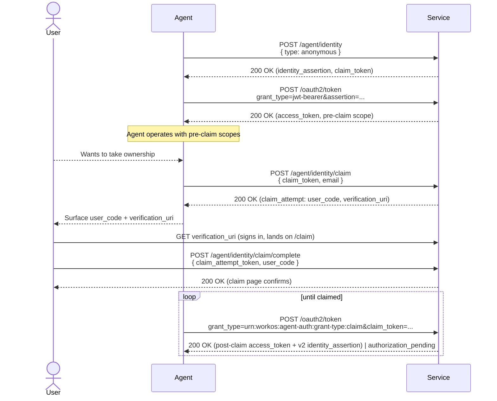
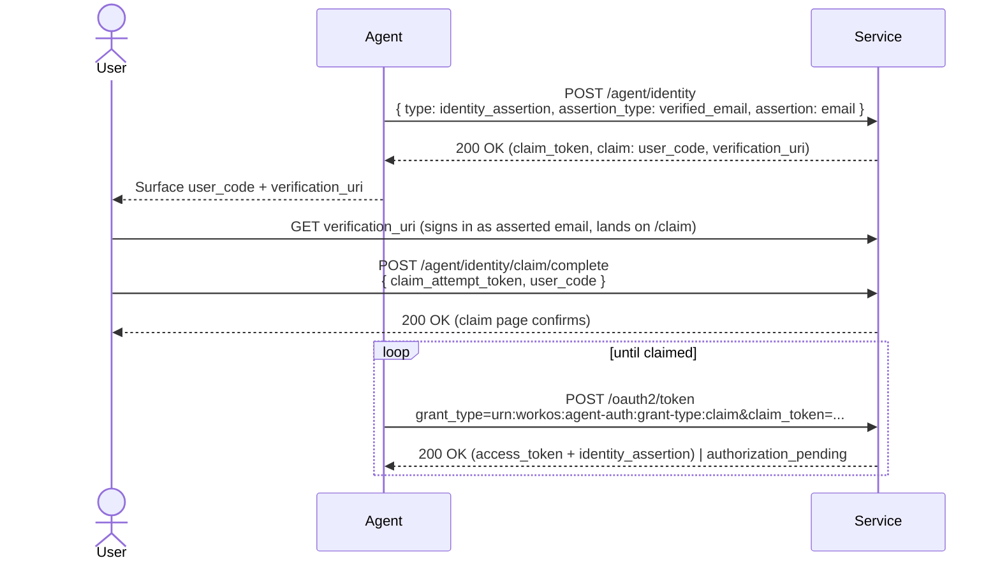

# Agent Auth Consumer Guide

Services that want agents to authenticate on behalf of users — via Identity Assertion JWT Authorization Grants ([ID-JAGs](https://datatracker.ietf.org/doc/html/draft-ietf-oauth-identity-assertion-authz-grant)) from trusted providers, via a verified-email claim ceremony, or via anonymous self-registration when no user identity is available — need to publish discovery metadata and implement the `/agent/identity` registration endpoint and standard OAuth `/oauth2/token` and `/oauth2/revoke` endpoints described here.

This guide covers three flows:

1. **ID-JAG identity assertion** — trusted agent providers (OpenAI, Anthropic, Cursor, etc.) assert a user's identity with an ID-JAG. The service verifies the assertion and returns a service-signed identity_assertion the agent exchanges at the token endpoint for an access_token.
2. **Verified-email identity assertion** — the agent gives us a user email; the service mints a 6-digit `user_code` and returns it to the agent, the agent surfaces it to the user, the user signs in on a service page and types the code to authorize the agent.
3. **Anonymous registration** — an agent with no user identity self-registers for a pre-claim identity_assertion and optionally invites a human to take ownership later via the same code-handoff ceremony.

All three flows share the same `/agent/identity` registration endpoint and terminate at `/oauth2/token` (RFC 7523 JWT-bearer) for credential issuance. Verified-email and anonymous flows additionally use the [RFC 8628](https://datatracker.ietf.org/doc/html/rfc8628) device-authorization-shaped claim ceremony.

**Why adopt this.** ID-JAG is a near-drop-in if your service already JIT-provisions users via OIDC or SAML — it's standard JWT verification against a provider JWKS plus a delegation record per `(iss, sub, aud)`, with no user-model changes. The claim flows are a real extension (a pre-claim principal state, a claim state machine, a scope-set swap) but they unlock MCP-server agents that start with no user identity — a use case nothing else handles cleanly. All three flows give users a real revoke surface for agent delegations, instead of copy-pasted API keys the service has no visibility into.

## Sequence Diagrams

### Identity Assertion



### Anonymous Registration + Claim Ceremony



### Verified-Email Identity Assertion



## Minimum Consumer Implementation

To participate as a consumer service, you should:

1. Publish `.well-known/oauth-protected-resource` (resource + `authorization_servers`) and `.well-known/oauth-authorization-server` (top-level OAuth endpoints + `agent_auth` block)
2. Return `WWW-Authenticate: Bearer resource_metadata="..."` on 401 responses
3. Host `/agent/identity` (and its `/claim` sub-endpoints) that dispatches on `type` and returns a service-signed `identity_assertion`
4. Host `/oauth2/token` (RFC 7523 JWT-bearer) that exchanges the `identity_assertion` for an access_token
5. Host `/oauth2/revoke` (RFC 7009) for agent-initiated credential revocation
6. Accept provider-initiated Security Event Tokens (RFC 8417) at the advertised `events_endpoint`
7. Maintain a trust list of agent providers (for `identity_assertion`)
8. Verify ID-JAG signatures against the provider's JWKS and enforce claim checks
9. Record audit events for every state change in the flow

### Publishing the Discovery Documents

Discovery is split in two:

1. The Protected Resource Metadata at `/.well-known/oauth-protected-resource` (per [RFC 9728](https://datatracker.ietf.org/doc/html/rfc9728)) advertises the resource and points at the Authorization Server.
2. The Authorization Server metadata at `/.well-known/oauth-authorization-server` carries the `agent_auth` block describing supported flows.

PRM:

```json
{
  "resource": "https://api.service.example.com/",
  "resource_name": "Service",
  "resource_logo_uri": "https://service.example.com/logo.png",
  "authorization_servers": ["https://auth.service.example.com/"],
  "scopes_supported": ["api.read", "api.write"],
  "bearer_methods_supported": ["header"]
}
```

AS metadata:

```json
{
  "resource": "https://api.service.example.com/",
  "authorization_servers": ["https://auth.service.example.com/"],
  "scopes_supported": ["api.read", "api.write"],
  "bearer_methods_supported": ["header"],

  "issuer": "https://auth.service.example.com",
  "token_endpoint": "https://auth.service.example.com/oauth2/token",
  "revocation_endpoint": "https://auth.service.example.com/oauth2/revoke",
  "grant_types_supported": [
    "urn:ietf:params:oauth:grant-type:jwt-bearer",
    "urn:workos:agent-auth:grant-type:claim"
  ],

  "agent_auth": {
    "skill": "https://service.example.com/auth.md",
    "identity_endpoint": "https://auth.service.example.com/agent/identity",
    "claim_endpoint": "https://auth.service.example.com/agent/identity/claim",
    "events_endpoint": "https://auth.service.example.com/agent/event/notify",
    "identity_types_supported": ["anonymous", "identity_assertion"],
    "identity_assertion": {
      "assertion_types_supported": [
        "urn:ietf:params:oauth:token-type:id-jag",
        "verified_email"
      ]
    },
    "events_supported": [
      "https://schemas.workos.com/events/agent/auth/identity/assertion/revoked"
    ]
  }
}
```

Top-level `issuer` / `token_endpoint` / `revocation_endpoint` / `grant_types_supported` follow [RFC 8414](https://datatracker.ietf.org/doc/html/rfc8414) (with `revocation_endpoint` per [RFC 7009](https://datatracker.ietf.org/doc/html/rfc7009)). The `agent_auth` block is a profile extension for the agent-auth–specific surface: the registration endpoint, the claim ceremony, and the [RFC 8935](https://datatracker.ietf.org/doc/html/rfc8935) SET receiver.

Advertise the identity types and assertion types your service accepts. Anonymous is the simplest if you only support self-registration; ID-JAG is for trusted-provider integrations; the verified email assertion type is for agents that have a user email but no provider-signed assertion.

On any 401 from your API, include the discovery hint:

```
HTTP/1.1 401 Unauthorized
WWW-Authenticate: Bearer resource_metadata="https://api.service.example.com/.well-known/oauth-protected-resource"
```

Consider also publishing an `auth.md` at your root — a short, LLM-readable summary of your agent auth posture that points back at the PRM, for agents that discover via documentation rather than 401 probing.

### Hosting the /agent/identity Endpoint

The endpoint dispatches on the `type` field. All requests scope to a single tenant / environment; how the service resolves that scope (hostname, bearer token, path prefix) is up to the implementation. Every path through this endpoint returns a service-signed `identity_assertion` (a JWT with `typ: oauth-id-jag+jwt` and `sub = registration.id`) — never a credential. The agent exchanges that assertion at [`/oauth2/token`](#post-oauth2token--rfc-7523-jwt-bearer-grant) to obtain an access_token.

```http
POST /agent/identity HTTP/1.1
Host: auth.service.example.com
Content-Type: application/json
```

#### type: identity_assertion

Request:

```json
{
  "type": "identity_assertion",
  "assertion_type": "urn:ietf:params:oauth:token-type:id-jag",
  "assertion": "eyJhbGc..."
}
```

Implementation steps:

1. **Decode the ID-JAG header** to obtain `kid` and `alg`.
2. **Look up the issuer (`iss`)** in your trusted providers list. Reject if unknown.
3. **Fetch JWKS** from the provider (see [Verifying ID-JAGs](#verifying-id-jags) for caching).
4. **Verify the signature** using the key matching `kid`.
5. **Validate claims:** `aud` matches your auth server; `exp` is future; `iat` is not unreasonably future; `jti` has not been seen recently; `client_id` resolves to a known provider identity; at least one of `email_verified` or `phone_number_verified` is `true`.
6. **Match or provision the user** (see [User Matching and JIT Provisioning](#user-matching-and-jit-provisioning)).
7. **Mint a service-signed identity_assertion** (typed `oauth-id-jag+jwt`, signed by your AS key, with `sub` = the registration ID). This is what the agent will exchange at `/oauth2/token`.

Successful response:

```json
{
  "registration_id": "reg_...",
  "registration_type": "agent-provider",
  "identity_assertion": "<service-signed JWT>",
  "assertion_expires": "2026-05-04T13:00:00.000Z",
  "scopes": ["api.read", "api.write"]
}
```

The agent then POSTs the `identity_assertion` to [`/oauth2/token`](#post-oauth2token--rfc-7523-jwt-bearer-grant) to obtain an access_token. No credential is issued at `/agent/identity` itself.

Error response (400):

```json
{ "error": "invalid_audience", "message": "..." }
```

Supported error codes: `invalid_issuer`, `invalid_signature`, `expired`, `replay_detected`, `invalid_audience`, `invalid_client_id`, `missing_verified_email`.

#### type: anonymous

Request:

```json
{ "type": "anonymous" }
```

Implementation steps:

1. Apply rate limits (see [Rate Limiting](#rate-limiting)).
2. Create the registration. The principal it eventually binds to is up to the service — it might be a user, workspace, account, tenant, or organization. Flag it as agent-created so downstream events and UI can distinguish it.
3. Generate a claim token (prefixed, high-entropy — e.g., `clm_` + 25 chars base62). Store only its SHA-256 hash. Return the plaintext exactly once.
4. Mint a service-signed `identity_assertion` bound to the registration. At `/oauth2/token` exchange time, unclaimed anonymous registrations get the pre-claim scope set.
5. Schedule an expiration job at the registration's TTL to mark the claim expired.

Successful response:

```json
{
  "registration_id": "reg_01ABC123DEF456GHI789JKL0MN",
  "registration_type": "anonymous",
  "identity_assertion": "<service-signed JWT>",
  "assertion_expires": "2026-05-04T13:00:00.000Z",
  "pre_claim_scopes": ["api.read"],
  "claim_url": "/agent/identity/claim",
  "claim_token": "clm_abc123def456ghi789jkl012mno",
  "claim_token_expires": "2026-04-22T12:34:56.789Z",
  "post_claim_scopes": ["api.read", "api.write"]
}
```

See [Claim Ceremony](#claim-ceremony) for the `/agent/identity/claim` init and the agent's poll loop. After a successful claim the agent re-exchanges the same `identity_assertion` at `/oauth2/token` to pick up the `post_claim_scopes`.

#### type: identity_assertion (verified email)

Request:

```json
{
  "type": "identity_assertion",
  "assertion_type": "verified_email",
  "assertion": "user@example.com"
}
```

Implementation steps:

1. Create a registration row marked as `email-verification` and persist the asserted email as `claim_email`.
2. Generate a `claim_token` (returned to the agent), a `claim_attempt_token` (embedded in `verification_uri`), and a 6-digit `user_code`. Store SHA-256 hashes of all three; return the plaintext `claim_token` and `user_code` in the response, embed the `claim_attempt_token` in the `verification_uri`.
3. Return the claim handles + a `claim` block (see [Claim Ceremony](#claim-ceremony)) — but **no identity_assertion**. The assertion is minted when the user completes the ceremony and the agent polls `/oauth2/token` with the claim grant.

Successful response:

```json
{
  "registration_id": "reg_01ABC...",
  "registration_type": "email-verification",
  "claim_url": "/agent/identity/claim",
  "claim_token": "clm_abc123...",
  "claim_token_expires": "2026-04-22T12:34:56.789Z",
  "post_claim_scopes": ["api.read", "api.write"],
  "claim": {
    /* user_code, verification_uri, expires_in, interval */
  }
}
```

### POST /oauth2/token

The token endpoint handles two grants, dispatched on `grant_type`:

- `urn:ietf:params:oauth:grant-type:jwt-bearer` — agent presents a service-signed identity_assertion in exchange for an access_token. See below.
- `urn:workos:agent-auth:grant-type:claim` — agent polls during the claim ceremony. See [Claim Ceremony → Agent poll](#post-oauth2token-claim-grant--agent-poll).

#### JWT-bearer grant (RFC 7523)

The agent presents the service-signed identity_assertion to exchange it for an access_token. Standard [RFC 7523](https://datatracker.ietf.org/doc/html/rfc7523) JWT-bearer grant, form-encoded:

```
POST /oauth2/token HTTP/1.1
Host: auth.service.example.com
Content-Type: application/x-www-form-urlencoded

grant_type=urn:ietf:params:oauth:grant-type:jwt-bearer
&assertion=<identity_assertion>
&resource=https://api.service.example.com/
```

Implementation steps:

1. **Parse the form-encoded body.** Validate `grant_type`; route to this handler. If the value is something else (and not the claim grant), return `unsupported_grant_type`.
2. **Verify the `assertion`** against your service's signing key. It must be `typ: "oauth-id-jag+jwt"`, with `iss` and `aud` equal to your AS, a valid `exp`, and a `sub` resolving to a registration in your store.
3. **Look up the registration by `sub`.** If absent or expired, return `invalid_grant`.
4. **Issue an access_token** scoped per the registration's state. Anonymous-unclaimed gets your configured pre-claim scopes; everything else gets the registration's full granted set.

Successful response (standard OAuth shape per RFC 6749 §5.1):

```json
{
  "access_token": "<token>",
  "token_type": "Bearer",
  "expires_in": 3600,
  "scope": "api.read api.write"
}
```

The token endpoint should never issue a `refresh_token`. The same `identity_assertion` can be re-exchanged at `/oauth2/token` to refresh the access_token until the assertion itself expires.

Error response uses standard OAuth error codes (RFC 6749 §5.2):

```json
{ "error": "invalid_grant", "error_description": "..." }
```

Supported error codes: `invalid_request`, `invalid_grant`, `unsupported_grant_type` (plus the claim grant's `authorization_pending`, `slow_down`, `expired_token` from [its handler](#post-oauth2token-claim-grant--agent-poll)).

### POST /oauth2/revoke — RFC 7009 token revocation

The agent (or an admin via back-channel) POSTs the access_token to revoke:

```
POST /oauth2/revoke HTTP/1.1
Host: auth.service.example.com
Content-Type: application/x-www-form-urlencoded

token=<access_token>&token_type_hint=access_token
```

Implementation:

- Mark the credential revoked. 200 OK on success, no body. Idempotent.
- Return 200 even when the token is unknown or already revoked ([RFC 7009 §2.2](https://datatracker.ietf.org/doc/html/rfc7009#section-2.2) — prevents enumeration).
- Return 400 with `{ "error": "invalid_request", "error_description": "..." }` only when the body itself is malformed.

The agent's `identity_assertion` is unaffected — they can immediately re-call `/oauth2/token` to mint a fresh access_token. To kill the underlying registration, the provider POSTs a SET to the `events_endpoint` (see [Revocation](#revocation)).

### Verifying ID-JAGs

A compliant ID-JAG header is `{ "typ": "oauth-id-jag+jwt", "alg", "kid" }`. The body includes `iss`, `sub`, `aud`, `client_id`, `jti`, `iat`, `exp`, and identity claims like `email` / `email_verified`. See the provider guide for the full shape.

**Trust list.** Maintain a registry of providers whose assertions you accept. A minimum entry is an issuer URL; richer entries pin a JWKS URI, a CIMD URL, or an attestation policy (e.g. "requires `mfa` in `amr`"). Treat this list as security-critical configuration — compromising a trusted provider means compromising every delegation routed through them.

**JWKS fetching.** Fetch `{iss}/.well-known/jwks.json` on first use and cache per the response's `Cache-Control`, with a sane floor (e.g., 10 minutes) and ceiling (e.g., 24 hours). On `kid` cache miss, refetch once before rejecting — this handles provider key rotation gracefully.

**CIMD resolution.** If `client_id` is a URL rather than an opaque identifier, fetch it as an [OAuth Client ID Metadata Document](https://datatracker.ietf.org/doc/draft-ietf-oauth-client-id-metadata-document/) and verify its `jwks_uri` matches the one you used to verify the signature. This decouples the provider's identity from their signing keys so rotation doesn't churn your trust list.

**Replay protection.** Keep a cache of seen `jti` values with a TTL of at least `exp - iat` plus clock skew (a 5-minute assertion + 1 minute of skew → 6 minutes of cache). Redis, Memcached, or an indexed database table with a TTL column all work. Reject on collision with `replay_detected`.

**Clock skew.** Accept `iat` up to ~1–2 minutes in the future to accommodate drift between provider and consumer clocks.

### User Matching and JIT Provisioning

When an ID-JAG arrives, decide which of your users it represents. Recommended resolution order:

1. **Delegation record match.** If you've previously issued credentials for this `(iss, sub)`, route to the same user. This is the strongest identifier — it's what the provider considers stable.
2. **Verified email match.** If a user exists with the same verified email, link. Note this is _your_ verification; a provider asserting `email_verified: true` reflects their verification, which you may or may not accept as sufficient.
3. **Verified phone match.** Same pattern.
4. **No match → JIT.** Create a new user per your provisioning policy, or refuse with `missing_verified_email`-adjacent semantics if your product requires manual onboarding.

Reject ID-JAGs with neither a verified email nor a verified phone — there's no basis for matching and no channel for user-facing communications (revocation notices, claim emails, etc.).

### Claim Ceremony

Both `anonymous` and `verified_email` flows funnel into the same ceremony: the service mints a `user_code`, the agent surfaces it to the user along with a `verification_uri`, the user signs in to the service and types the code on a service-owned form, the agent polls for completion. The ceremony block borrows from [RFC 8628 device authorization](https://datatracker.ietf.org/doc/html/rfc8628), and polling happens at the standard `token_endpoint` with a profile-specific grant (`urn:workos:agent-auth:grant-type:claim`).

The user_code travels **agent → user → service**, not service → user → agent. This means there's no email containing a code that a phishing agent could intercept — the agent already has the code, and the only place it can be redeemed is on the service's own claim page after the user signs in.

**Why a profile-specific grant URN.** Polling could in principle reuse `urn:ietf:params:oauth:grant-type:device_code`, but a service implementing standard RFC 8628 device authorization at the same token endpoint would then have to disambiguate by inspecting the bearer value (claim_token vs device_code). A custom URN routes by grant_type, which is where OAuth implementations already dispatch — no collision risk.

| Flow           | Ceremony block returned at                | Claim grant returns                                                                                             |
| -------------- | ----------------------------------------- | --------------------------------------------------------------------------------------------------------------- |
| Anonymous      | `/agent/identity/claim` (`claim_attempt`) | Standard OAuth token response + a **v2** identity_assertion (the v1 was pre-claim; v2 carries the user's email) |
| Verified-email | `/agent/identity` (`claim`)               | Standard OAuth token response + the first identity_assertion (none was issued at registration time)             |

#### Ceremony block shape

Returned nested under `claim` (email-verification registration response) or `claim_attempt` (anonymous `/claim` response):

```json
{
  "user_code": "123456",
  "expires_in": 600,
  "verification_uri": "https://auth.service.example.com/login?return_to=%2Fclaim%3Fclaim_attempt_token%3D...",
  "interval": 5
}
```

The `verification_uri` routes through `/login` first so the user authenticates before landing on the claim page. `claim_attempt_token` (in the return_to path) binds the URL to a specific registration — opening the URL identifies the registration without revealing the `user_code`.

#### POST /agent/identity/claim — Anonymous claim entry

Anonymous-only. Verified-email registrations skip this — their ceremony block is bundled into the `/agent/identity` registration response.

Request:

```json
{
  "claim_token": "clm_abc123...",
  "email": "user@example.com"
}
```

The `email` binds the registration to the human the agent is acting for. Only that signed-in user can complete the ceremony — without this binding, a third party who intercepts the `user_code` could claim the agent on their own account.

Response (200):

```json
{
  "registration_id": "reg_01ABC...",
  "claim_attempt_id": "cla_01XYZ...",
  "status": "initiated",
  "expires_at": "2026-05-04T12:10:00.000Z",
  "claim_attempt": {
    /* ceremony block, see above */
  }
}
```

`claim_attempt_id` identifies the current claim attempt. A new identifier is minted each time a fresh attempt is initiated — including same-email retries; the previous URL stops working.

Implementation notes:

- Hash the incoming `claim_token` and look up the registration. Reject if not found (`invalid_claim_token`), already claimed (`claimed_or_in_flight`), or expired (`claim_expired`).
- Record `claim_email` on the registration so the claim page can enforce the binding.
- Mint a `claim_attempt_token` and a `user_code`; store SHA-256 hashes of both, return the plaintexts.
- The `verification_uri` should route through your sign-in flow first (so the user authenticates before the claim page can identify them).

#### User-facing claim form

The user opens `verification_uri`, signs in to the service, and lands on a page that:

1. Resolves the registration via `claim_attempt_token` (from the URL).
2. Verifies the signed-in user matches `registration.claim_email` if set — rejects mismatches.
3. Renders a form that POSTs `claim_attempt_token` + the typed `user_code` to a service-owned form-action endpoint.
4. On the form post, the service verifies the `user_code` against the registration's stored hash and marks the claim complete. Same-account check applies again on submit.

This is a service-owned UX surface — agents never see it.

#### POST /oauth2/token (claim grant) — Agent poll

Polling happens at the standard `token_endpoint` with a profile-specific grant. Form-encoded, as with the JWT-bearer grant:

```
POST /oauth2/token HTTP/1.1
Host: auth.service.example.com
Content-Type: application/x-www-form-urlencoded

grant_type=urn:workos:agent-auth:grant-type:claim
&claim_token=<clm_...>
```

While the user has not completed the ceremony (RFC 8628 §3.5 vocabulary, served via the standard OAuth error envelope):

```json
{
  "error": "authorization_pending",
  "error_description": "The user has not yet completed the ceremony."
}
```

On completion: a standard OAuth token response, extended with `identity_assertion` and `assertion_expires`:

```json
{
  "access_token": "<post-claim access_token>",
  "token_type": "Bearer",
  "expires_in": 3600,
  "scope": "api.read api.write",
  "identity_assertion": "<service-signed JWT>",
  "assertion_expires": "2026-05-04T13:00:00.000Z"
}
```

When the ceremony window has closed:

```json
{
  "error": "expired_token",
  "error_description": "The claim ceremony window has closed."
}
```

Implementation notes:

- Look up the registration by `sha256(claim_token)`. If absent → `expired_token`. If `status === "expired"` → `expired_token`. If `status !== "claimed"` → `authorization_pending`. If claimed → mint a fresh access_token and a fresh identity_assertion.
- For **anonymous**, on completion the pre-claim access_tokens (from earlier jwt-bearer exchanges) should be **revoked** — the canonical credential is the one returned here. The v2 identity_assertion includes the now-known `email` / `email_verified` claims; the v1 the agent held has neither.
- For **email-verification**, this is the first time an identity_assertion exists for this registration — the agent uses it for jwt-bearer refreshes once the returned access_token expires.
- Honor RFC 8628's `interval` — return `{ "error": "slow_down" }` if the agent polls faster than advertised.
- Emit `claim.confirmed` (see [Recommended Audit Events](#recommended-audit-events)).

### Revocation

Revocation has two distinct surfaces:

1. **Agent or admin invalidating a specific credential** — RFC 7009 token revocation at the top-level `revocation_endpoint` (covered in [POST /oauth2/revoke](#post-oauth2revoke--rfc-7009-token-revocation)).
2. **Provider notifying the service of an upstream identity event** — RFC 8935 push-based delivery of a [Security Event Token](https://datatracker.ietf.org/doc/html/rfc8417) to the `agent_auth.events_endpoint`.

#### POST /agent/event/notify — RFC 8935 SET receiver

Providers transmit a signed Security Event Token to deliver identity events (logout, unlink, etc.). The SET's `events` claim names one or more schema URIs identifying the event types in this envelope:

```
POST /agent/event/notify HTTP/1.1
Host: auth.service.example.com
Content-Type: application/secevent+jwt

{ "typ": "secevent+jwt", "alg", "kid" }
.
{
  "iss": "https://api.agent-provider.example.com",
  "sub": "<opaque user identifier>",
  "aud": "https://auth.service.example.com",
  "jti": "<unique identifier>",
  "iat": <epoch seconds>,
  "events": {
    "https://schemas.workos.com/events/agent/auth/identity/assertion/revoked": {}
  }
}
```

On receipt:

1. Verify the SET signature against the issuer's JWKS (same trust path as ID-JAG verification).
2. Validate `iss` against the trust list, `aud` against your service, and enforce `jti` uniqueness for replay protection.
3. Dispatch on each entry in the `events` claim — for the `identity-assertion-revoked` schema, find all credentials issued for `(iss, sub, aud)` and invalidate them. Unknown event schemas can be safely ignored ([RFC 8417 §2.2](https://datatracker.ietf.org/doc/html/rfc8417#section-2.2)).
4. Return 202 Accepted on success, with no body.
5. On failure, return 400 with `{ "err": "<code>", "description": "..." }` per [RFC 8935 §2.4](https://datatracker.ietf.org/doc/html/rfc8935#section-2.4). Defined error codes: `invalid_request`, `invalid_key`, `invalid_issuer`, `invalid_audience`, `authentication_failed`.

The same endpoint can accept additional event types in the future (account suspended, claims updated, etc.) by adding entries to your dispatch table — providers don't need to coordinate; the `events_supported` array in your discovery doc advertises which schemas you're prepared to handle.

A future evolution of this surface is the OpenID [Shared Signals Framework](https://openid.net/specs/openid-sharedsignals-framework-1_0.html) — a stream-management protocol on top of RFC 8935 with subject subscriptions and polling. Today we accept push-only and don't expose stream management.

### Rate Limiting

The `/agent/identity` endpoint is unauthenticated for anonymous registration and accepts bearer ID-JAGs for identity assertion. Both paths benefit from two-tier rate limiting, checked in order:

1. **Per-IP limit** (checked first). Prevents a single source from consuming the tenant's budget. Sensible default: 5/hour for anonymous, 60/hour for identity_assertion.
2. **Per-tenant limit** (checked second). Global cap across IPs. Sensible default: 100/hour anonymous, 1000/hour identity_assertion.

Use a sliding-window counter backed by a shared store (Redis is common). Fail open on store errors to avoid blocking legitimate traffic. If no IP is available (e.g., stripped by a proxy), skip the per-IP check rather than rejecting.

### Recommended Audit Events

Record the following state transitions for observability and incident response. How they're exposed — audit log, webhook, SIEM stream, admin API — is an implementation choice; the set of events and the data they carry is the useful baseline.

| Event                  | When                                                        | Recommended fields                      |
| ---------------------- | ----------------------------------------------------------- | --------------------------------------- |
| `registration.created` | Any successful `/agent/identity` POST                       | `registration_id`, `registration_type`  |
| `assertion.issued`     | A service-signed identity_assertion is minted               | `registration_id`                       |
| `token.issued`         | `/oauth2/token` returns an access_token                     | `registration_id`, `scope`              |
| `token.revoked`        | `/oauth2/revoke` invalidates a credential                   | `registration_id`                       |
| `claim.requested`      | `/agent/identity/claim` called (or implicit on email-verification) | `registration_id`, `email`              |
| `user_code.minted`     | user_code minted at ceremony start                          | `registration_id`                       |
| `claim.confirmed`      | `/agent/identity/claim/complete` succeeds                   | `registration_id`, `claimed_by_user_id` |
| `registration.expired` | Unclaimed registration past its TTL                         | `registration_id`                       |
| `registration.revoked` | SET processed at `/agent/event/notify`                      | `registration_id`, `iss`, `sub`         |

For ID-JAG flows, include `iss`, `sub`, `agent_platform`, and `agent_context_id` so operators can correlate with provider-side logs.

Services that already expose resource events (for API keys, invitations, membership, or whatever principal the service creates) should consider tagging those events with `created_by_agent: true` and a status field (`unclaimed` / `claimed` / `expired`) so consumers don't have to cross-reference the agent-registration events to determine whether a given resource is agent-related.

## Security Considerations

- **Token hashing.** The `claim_token`, `claim_attempt_token`, and `user_code` are all bearer secrets with no proof of possession — store only SHA-256 hashes. Plaintext leaves the server exactly once: claim_token + user_code in the ceremony response to the agent, claim_attempt_token inside the `verification_uri` query string.
- **user_code entropy + TTL.** Use a CSPRNG (`crypto.randomInt`) for the `user_code`. Default to a short TTL (≤10 min) and tight per-claim retry limits at the `/claim` form-action — 6-digit codes are guess-bounded only by lockout, not entropy.
- **IP logging.** Capture IPs at registration, claim, and complete for audit trail.
- **Scope on /claim and /complete.** Both endpoints are public but must resolve to a tenant / environment, and reject tokens that don't belong to that scope even if the hash somehow collides.
- **Key reuse across the claim boundary.** For anonymous, the in-place permission swap means anyone who captured the API key pre-claim retains access post-claim with the new scopes. Offer forced rotation as an opt-in for security-sensitive tenants.
- **Bulk revocation.** Provide an operator-facing mechanism to revoke all outstanding agent credentials for a tenant in one shot — for incident response.
- **Assertion replay.** Cache `jti` values for at least the assertion lifetime plus clock skew. A shared store is required if `/agent/identity` runs across multiple replicas.
- **Trust list discipline.** Treat the trusted-providers list as security-critical configuration. Changes should be audited and rolled out with the same care as any auth config change.
